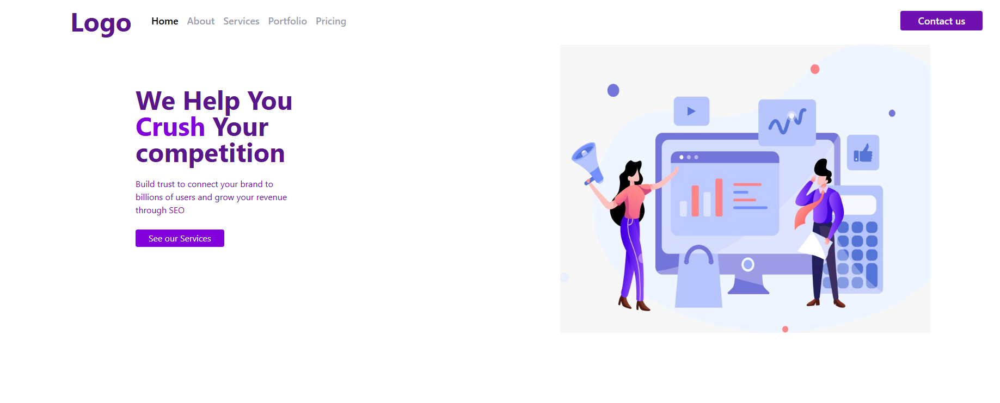

Project06 - Responsive Landing Page

[live@](https://logo-gray.vercel.app/)

This project is a responsive landing page built using HTML5, Tailwind CSS, and Font Awesome. It features a modern layout with a navigation bar, hero section, and call-to-action buttons — all optimized for mobile and desktop screens.

🧠 Overview

The landing page is designed to promote a business or service with a clean, minimal UI.
It includes:

A responsive navbar with navigation links

A hero section highlighting the company’s mission

A call-to-action button to encourage engagement

A hero image illustrating the brand

🛠️ Technologies Used

HTML5 – for structuring the page

Tailwind CSS (via CDN) – for rapid and responsive styling

Font Awesome (via CDN) – for icons and visual enhancement

# Preview
desktop preview

mobile preview

